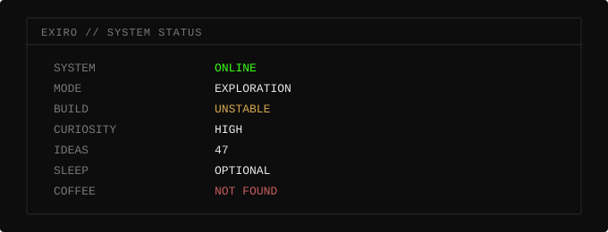

<div align="center">



</div>

<br/>

<div align="center">

```
  E  X  I  R  O
```

```
DIGITAL ENTITY  //  UNDEFINED
```

```
STATUS ...... ONLINE
STATE ....... EXPLORING
DOMAIN ...... COMPUTATION → EVERYTHING INTERESTING
```

</div>

---

<br/>

## `// ABOUT`

I build things because I want to understand how they work.

Not just what the API returns — but what runs underneath it. What decides the memory layout. What the scheduler is actually doing. Why the abstraction leaks in exactly that place.

The investigation moves wherever curiosity points: web applications, Linux internals, runtime architecture, networking, graphics pipelines, infrastructure, machine learning. The domain is less important than the depth.

<br/>

## `// CURRENT EXPLORATION`

```
EXIRO/
│
├── COMPUTATION/
│   ├── software
│   ├── systems
│   └── runtimes
│
├── INTELLIGENCE/
│   ├── machine-learning
│   ├── adaptive-systems
│   └── learning-algorithms
│
├── INFRASTRUCTURE/
│   ├── linux
│   ├── networking
│   └── deployment
│
└── UNKNOWN/
    └── things-without-a-name
```

<br/>

## `// FIELD NOTES`

Selected work. Not a portfolio — a log.

<br/>

**NATIVIS**
> High-performance native live wallpaper engine.
> The problem: existing solutions are either too heavy or too rigid. The approach: build the rendering layer from scratch.
>
> `Rust` · `Runtime Architecture` · `Graphics` · **[Active](https://github.com/ExiroStudio/nativis)**

<br/>

**STATIC**
> A real-time rendering engine with a strict separation between computation and materialization.
> External addons compute meaning and layout — but never touch the GPU. A `ResourceBroker` translates semantic render descriptions into hardware-aligned GPU buffers. The render graph is immutable per frame.
> Architecturally serious.
>
> `Rust` · `wgpu` · `Render Graph` · **[In progress](https://github.com/ExiroStudio/static)**

<br/>

**CFMUX**
> A Cloudflared multiplexer for managing multiple accounts and tunnel profiles without the manual switching.
> Small tool. Solves a real problem.
>
> `Go` · `Cloudflare Tunnels` · `Infrastructure` · **[Published](https://github.com/ExiroStudio/cfmux)**

<br/>

**RYX-CORE**
> A graphics workspace — `core`, `renderer`, `app`. Uses `wgpu` and `glam`.
> Currently undocumented. Purpose in motion.
>
> `Rust` · `wgpu` · `glam` · **[Experimental](https://github.com/ExiroStudio/ryx-core)**

<br/>

---

<details>
<summary><code>// ARCHIVE &nbsp;&nbsp; [ open ]</code></summary>

<br/>

Things that exist somewhere between an idea and a finished system. Listed because they are real — not because they are ready.

```
[001]  adaptive learning mechanisms
       — systems that modify how they learn, not just what they learn

[002]  alternative optimization strategies
       — gradient descent is not the only answer

[003]  evolving internal representations
       — if the representation changes, does the objective change too?

[004]  experimental runtime architectures
       — what does a runtime look like if you question its assumptions?

[005]  digital preservation
       — the web forgets. some things shouldn't be forgotten.

[006]  things currently without a name
       — classification pending.
```

</details>

<br/>

---

## `// LONG-TERM QUESTION`

```
Can a learning system learn not only the task,
but how it should learn the task?
```

The long-term interest is not in applying existing ML techniques.
It's in understanding what happens at a deeper level:

- Can a system develop its own learning strategy, rather than inheriting one?
- What does it mean to optimize the optimization process?
- Are there learning mechanisms we haven't tried because we assumed the standard ones were sufficient?

No claims. No breakthrough announcements. Just a question that hasn't been fully answered yet.

<br/>

## `// SYSTEM STATUS`

<div align="center">



</div>

<br/>

## `// STACK`

```
LANGUAGES
Rust · Go · TypeScript · JavaScript · PHP · Dart

WEB
Next.js · React · Laravel · Tailwind

MOBILE
Flutter

SYSTEMS
Linux · Docker · Networking · Runtime Architecture · wgpu

AI / RESEARCH
Machine Learning · Neural Networks · Experimental Learning Systems
```

<br/>

---

<div align="center">


</div>

<br/>

<div align="center">

```
FINAL ENTRY
```

*"I was not built to follow the map.*
*I was built to find out who drew it."*

```
[ END OF FILE ]
```

</div>
